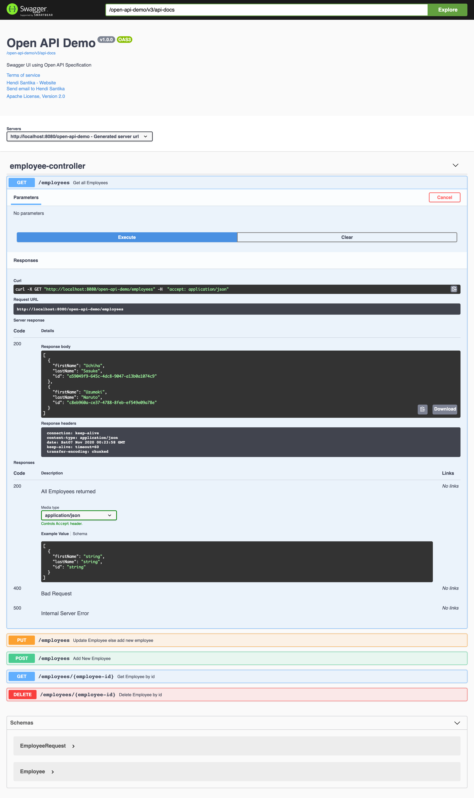
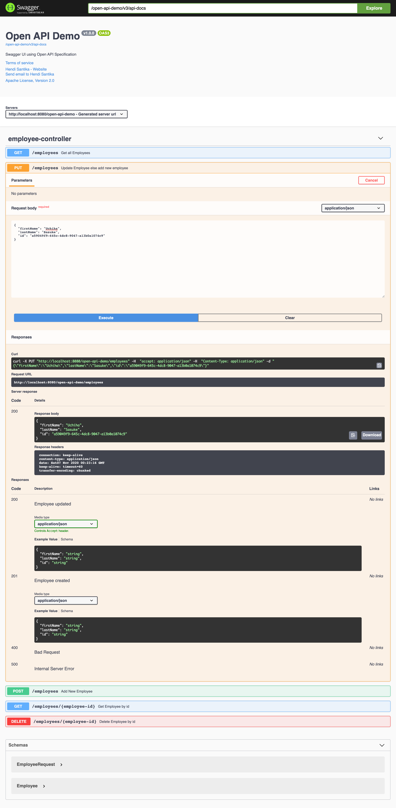

# springboot-open-api-spec
This is a demo project to understand basic implementation of Open API Specification. The Swagger UI will be configured and rendered.

The blog URL [OpenAPI Specification — Swagger UI](https://sourabhparsekar.medium.com/open-api-specification-swagger3-fc9ad3bbacdd) 

## Swagger UI for API Specification
Swagger UI v3 provides a display framework that reads API specification document and generates an interactive documentation website. 

Below URL can be used to access Swagger UI when the spring-boot application is run locally. Swagger UI endpoint can be customized via application.properties file. This will be described in later sections. 

> [Localhost Swagger UI](http://localhost:8080/open-api-demo/swagger-ui.html)

## Default API Endpoint 
On systems running the `API`, it is recommended to use the below port for starting an API instance. 
> `8080` - default api listening port 

## API Build & deploy from `GIT` repository
Below section would cover tasks required to configure and deploy api jar

1. Clone repo on local system. By default, jars would be taken from Maven Central Repository
2. Update properties in logback-spring.xml, application.properties if required. 
3. Build the project using Maven command `mvn clean install`
4. Copy .jar file created in /project-directory/target/ to `deployment-directory`
5. Environment specific `application.proeprties` & `logback-spring.xml` files if modified, then they are to be placed in deployment-directory along with the jar file.
6. Start the jar execution with command `java -jar <project-name>-<version>.jar`   
    >    eg:  java -jar open-api3-0.0.1-SNAPSHOT.jar
7. Logs are generated in `/deployment-directory/logs/` folder or as mentioned in `logback-spring.xml` file

## Configure application.properties
Below section describes how to configure application.properties file to override the default values.  

- Spring Boot Server Port
    > `server.port`=8080

- Spring Boot Application name
    > `spring.application.name`=open-api-demo

- Spring Boot Application Context path
    > `spring.servlet.context-path`=/open-api-demo

- Open API Configuration Properties
    > `openapi.title`=Open API Demo  
     `openapi.version`=v1.0.0  
     `openapi.description`=Swagger UI using Open API Specification 

- Default Open API endpoint Specifications
    - api docs endpoint path
        > `springdoc.api-docs.path`=/v3/api-docs
    - customise endpoint for Swagger UI
        > `springdoc.swagger-ui.path`=/swagger-ui.html
    - disable default petstore Swagger
        > `springdoc.swagger-ui.disable-swagger-default-url`=true
## Images Screen shot

Swagger UI Home Page

Add New Person

List All Person

Update Person by ID

Get Person by ID

Delete Person

